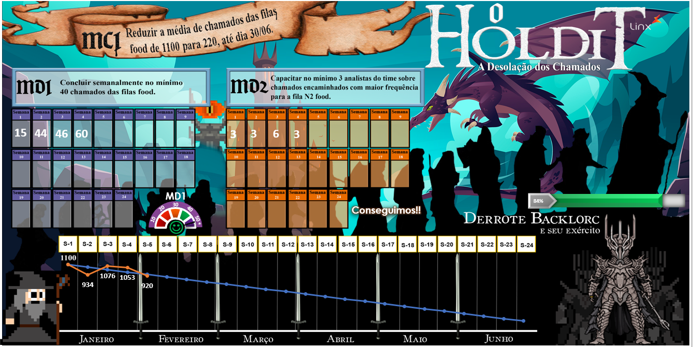

#  O que é 4DX?

Trablhei com essa metodologia por 1 ano, trata-se das **4 Disciplinas das Execução**, Chris McChesney, Sean Covey e Jim Huling, baseada no livro The 4 Disciplines of Execution.

O foco do 4DX é ajudar organizações a alcançarem metas estratégicas importantes, mesmo enquanto lidam com as demandas do dia a dia. Ele é composto por quatro disciplinas (daí o nome 4DX – 4 Disciplines of Execution):

> **Focar no que é vitalmente importante (WIG – Wildly Important Goals):**

Definir poucas metas realmente prioritárias para não dispersar esforços.

> **Agir nas medidas de direção (Lead Measures):**

Concentrar-se nas ações que realmente impactam o resultado (em vez de apenas olhar resultados finais, chamadas lag measures).

> **Manter um placar envolvente (Scoreboard):**

Visualizar o progresso de forma clara para que todos saibam se estão avançando ou não.

> **Criar uma cadência de responsabilidade (Cadence of Accountability):**

Reuniões periódicas para revisar progresso, ajustar ações e manter o time comprometido.

Em resumo, 4DX é um framework de execução de metas, usado por empresas para transformar estratégia em resultados concretos, e pode ser aplicado junto a metodologias ágeis ou tradicionais.

Fiquei responsável por criar o placar do meu SQUAD durante a aplicação do 4DX. Usei como base a temática do Hobbit, o qual ganhou o prêmio de melhor placar. Confira a baixo meu placar.

