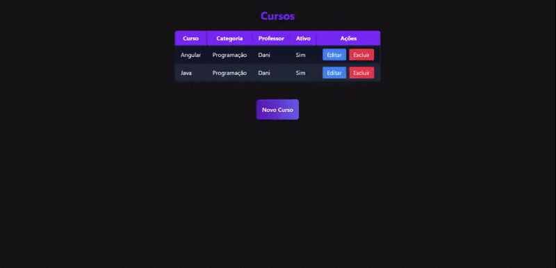
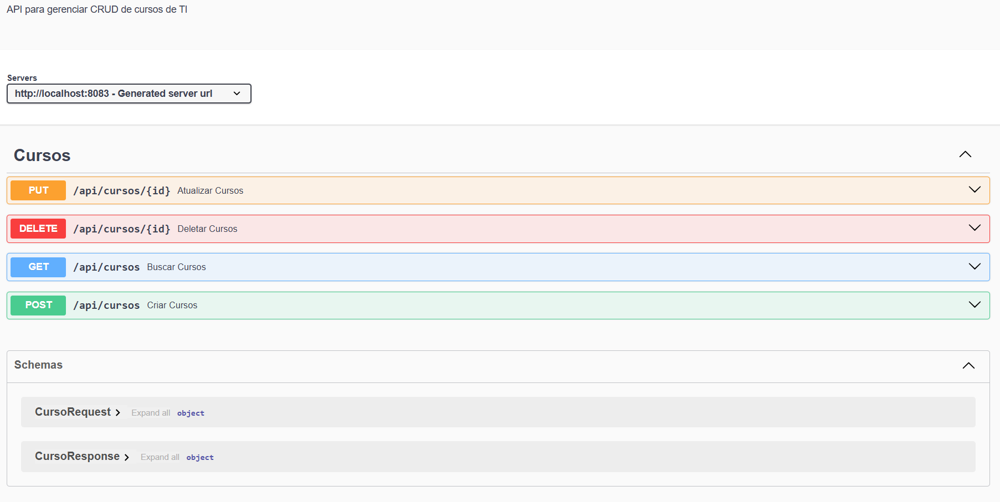

# 💼 **Projeto Java: API RESTful com CRUD Completo**

Este projeto consiste na construção de uma API RESTful utilizando **Java com Spring Boot**, **JPA** e **PostgreSQL** (Dbeaver). Ele implementa as operações completas de **CRUD (Create, Read, Update, Delete)**
em uma estrutura **MVC**, além de aplicar o padrão **DTO** para transferência de dados entre as camadas e utilizar a biblioteca **ModelMapper** para facilitar o mapeamento entre entidades e DTOs.

## Demonstração do Projeto

---

> 🚀 Tecnologias Utilizadas

- Java 17+
- PostgreSQL 
- Dbeaver
- Spring Boot

## Dependêcias
- Spring Data JPA
- ModelMapper
- Spring Actuator
- Spring Web
- Spring DevTools
- Spring Validation
- PostgreSql
- Thymeleaf
- Lombok

## Documentação e teste
  - Swagger
  
