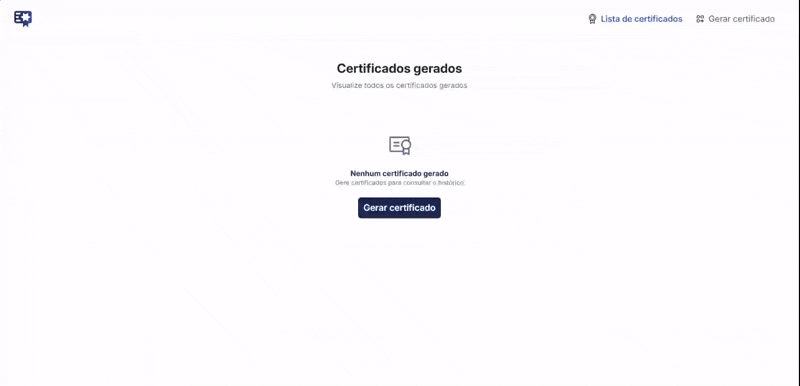

# 💼 **Projeto Angular: Gerador de certificado**

> 🎓 **Descrição Geral**

Este projeto, faz parte do curso introdutório de Angular da Rocketseat, com 10h de duração.

> ⚙️ **Tecnologias Utilizadas**
- Angular CLI v20
- Node v22
- HTML
- CSS
- TypeScript
- Figma
- Netlify

## 🖌️ Repositório Git do projeto:
[Acesse o Figma do projeto](https://github.com/felipevalboeno/ProjectRCKTS-Angular-Certificate-Generator)

## 🖌️ Figma do projeto:
[Acesse o Figma do projeto](https://www.figma.com/pt-br/comunidade/file/1508905005736436009/gestao-de-certificados)

## 💻 Link da aplicação no Netlify para teste em produção
[Acesse o projeto em produção](https://geradorcertificadomalchika.netlify.app)

## Demonstração do Projeto

