# <span style="color:green;">💼 **Gestão de Vagas — Projeto Spring Boot**</span>

> 🚀 **Descrição Geral**

Este projeto foi desenvolvido utilizando o **Spring Framework** e a linguagem **Java**, abordando conceitos essenciais da **Programação Orientada a Objetos (POO)** e boas práticas de arquitetura.  
O sistema tem como objetivo oferecer uma **plataforma de cadastro e gerenciamento de vagas de tecnologia**, onde:

- 🏢 **Empresas** podem realizar seu cadastro e publicar vagas.  
- 👩‍💻 **Candidatos** podem criar perfis, visualizar oportunidades e se candidatar.

---

> 🧩 **Principais Tecnologias e Recursos Utilizados**

- **Spring Boot**, **Spring Security**, **Spring Data JPA**
- **Thymeleaf** integrado com **TailwindCSS** (Front-end)
- **Swagger** para documentação dos endpoints
- **JUnit** e **Mockito** para testes unitários
- **Prometheus** para monitoramento da aplicação
- **Princípios SOLID** e boas práticas de clean code

---

> 🐳 **Infraestrutura e Deploy**

A aplicação é totalmente conteinerizada com **Docker**, utilizando imagens hospedadas no **DockerHub**, e foi implantada na **AWS (EC2 e RDS)**.  

Além disso:
- ⚙️ Foram configurados **GitHub Actions** para CI/CD.
- 🔐 As **secrets e variáveis de ambiente** são gerenciadas via GitHub.
- 🌐 Conexão com o **RDS** (MySQL) feita diretamente via extensão de banco de dados no VS Code.

> Exemplo de host usado na conexão:
```bash
db-gestao-vagas.c96cuumyu0ti.us-east-2.rds.amazonaws.com
```

## <span style = "color:green">Demonstração do Projeto</span>


---

### # <span style="color:orange;">**Boas práticas em programação Orientadaa Objetos utilizadas nesse projeto**</span>
- Single Responsability (SOLID)  
- KISS  
- YAGNI  
- Unit tests  
- Integration tests  
- JavaDoc

---

## # <span style="color:orange;">📈**Ferramentas de monitoramento utilizadas**</span>
Nesse projeto utilizei apenas o Prometheus no final. Teste os endpoints:

- [Health](http://3.139.102.156:8080/actuator/health)
- [Metrics](http://3.139.102.156:8080/actuator/metrics)
- [Prometheus](http://3.139.102.156:8080/actuator/prometheus)

Obs: devido a limitações de hardware, precisei retirar o Grafana do projeto até expandir meu SSD pra utilizar maiores imagens no docker.

---

## <span style="color:orange;">**Docmentação**</span>
Swagger documentation:

- [Swagger UI](http://3.139.102.156:8080/swagger-ui/index.html#/)

### **Endpoints**:
- Job listing
- Job registration
- Delete job
- Candidate Auth
- Job Apply
- Candidate profile
- Candidate Register
- Job listing by candidate
- Company register
- Auth company


**Swagger endpoints**

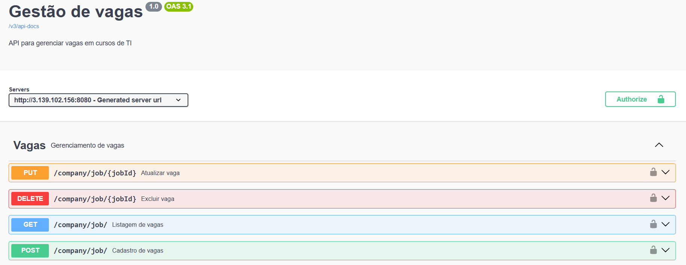

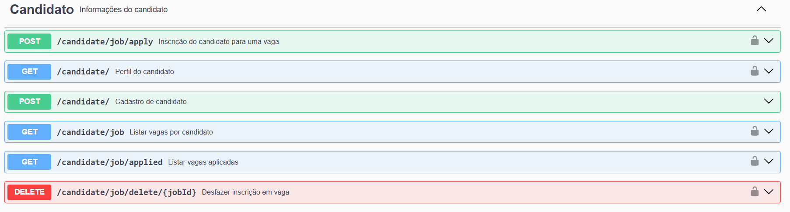

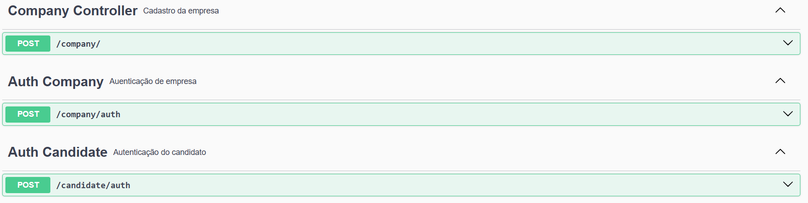

---

## <span style = "color:green"> **Back-end** </span>

- Java  
- SpringBoot

### 🏗 Fluxo de Atualização de Vagas

<span style="color:blue;">👤 Cliente / Frontend</span>   
- HTTP Request (GET, POST, PUT, DELETE)  

👇

<span style="color:green;">📝 Controller (JobController)</span>  
- Recebe request  
- Valida input / DTO  
- Pega companyId / path params / headers  
- Chama Use Case correspondente  
 
👇

<span style="color:orange;">⚙️ Use Case</span>  
- Lógica de negócio  
- Valida regras  
- Prepara entidade  
- Chama Repository  
 
👇

<span style="color:purple;">💾 Repository (JobRepository)</span>  
- Acessa banco de dados  
- Cria, atualiza, deleta ou busca dados  

### Estrutura do projeto BackEnd
```
├── src/main/java/br/com/felipevalboeno/gestao_vagas/
│ ├── config/
│ ├── exceptions/
│ ├── modules/
│ │ ├── candidate/
│ │ │ └── controllers
│ │ │ └── dto
│ │ │ └── entity
│ │ │ └── repository
│ │ │ └── useCases
│ │ ├── company/
│ │ │ └── controllers
│ │ │ └── dto
│ │ │ └── entity
│ │ │ └── repository
│ │ │ └── useCasess
│ │ └── ...
│ ├── providers/
│ └── security/
└── application.properties
```
---

# <span style="color:orange;">**Front-end**</span>  
- Tailwind  
- RestTemplate para conectar com o backend

# <span style="color:orange;">**Pages**</span>  
### Candidato


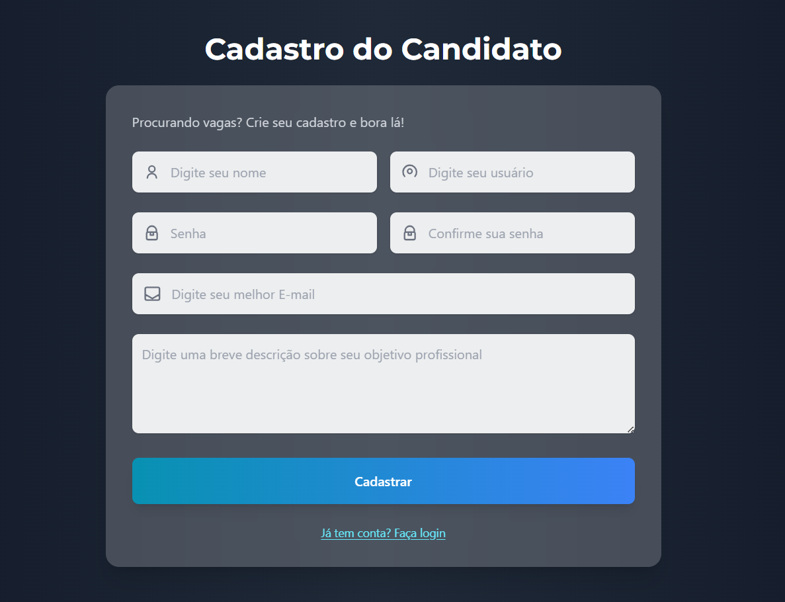
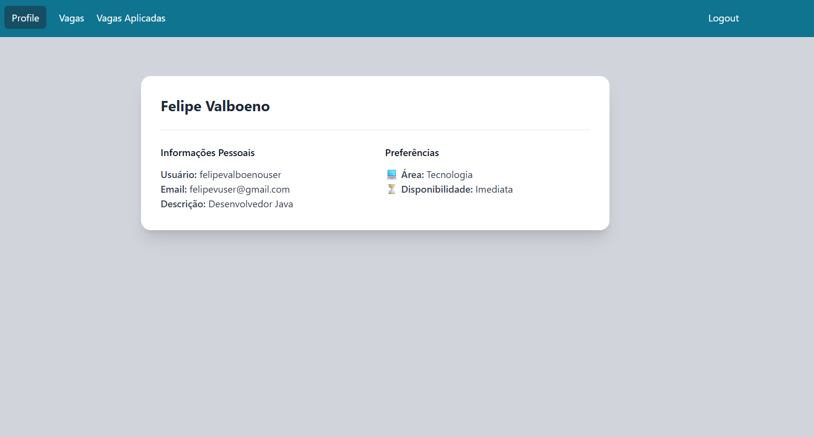
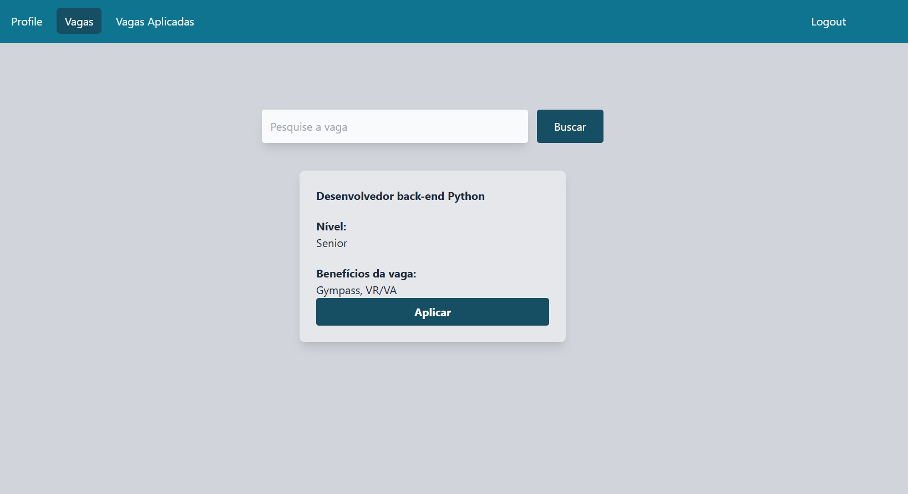
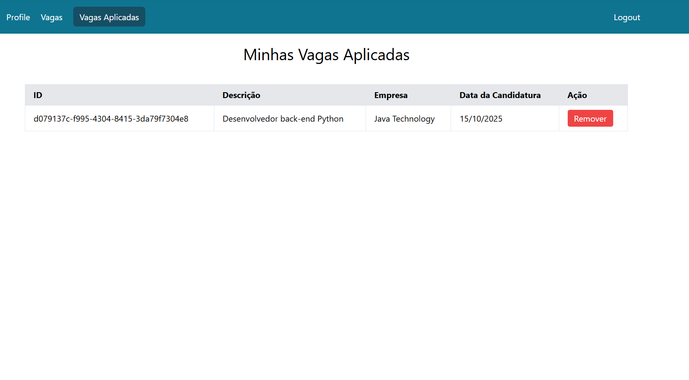

### Empresa

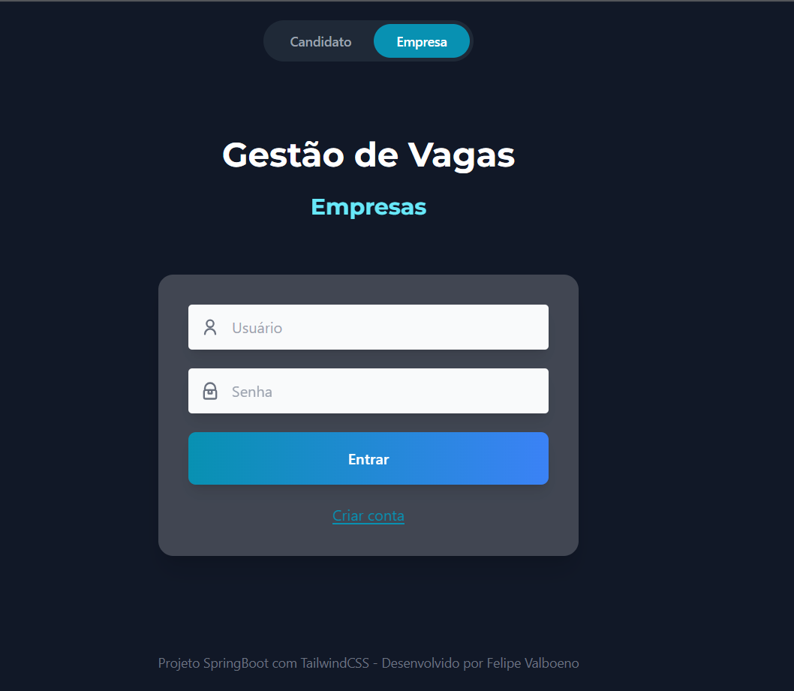
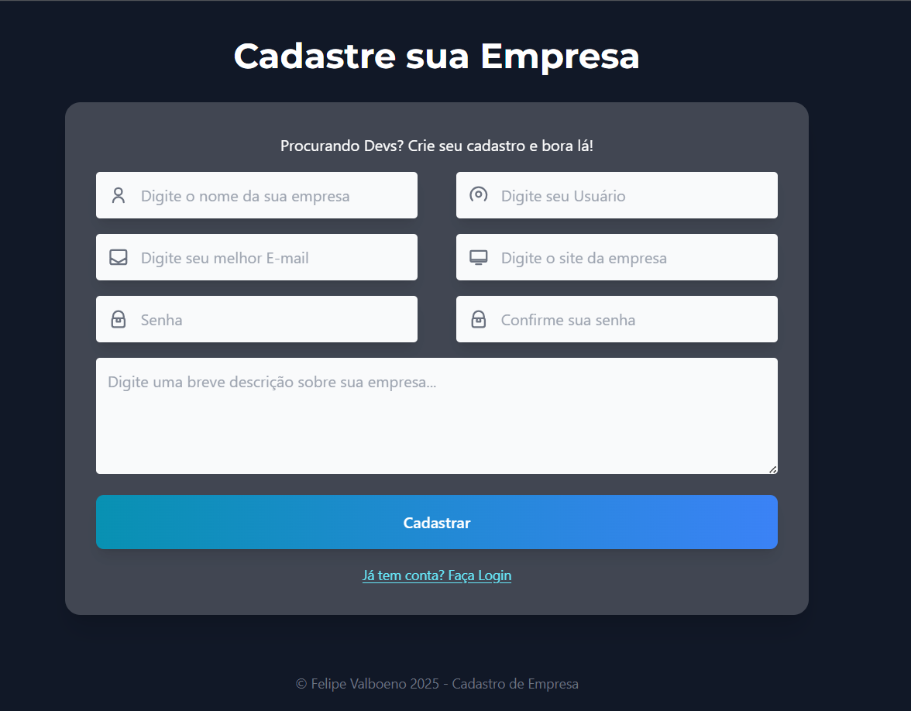
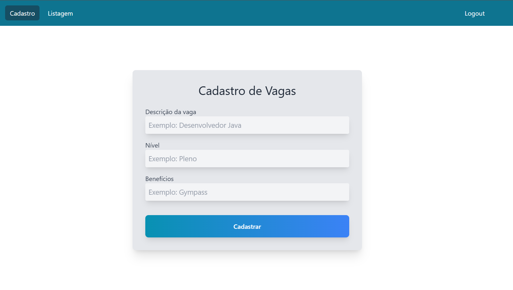
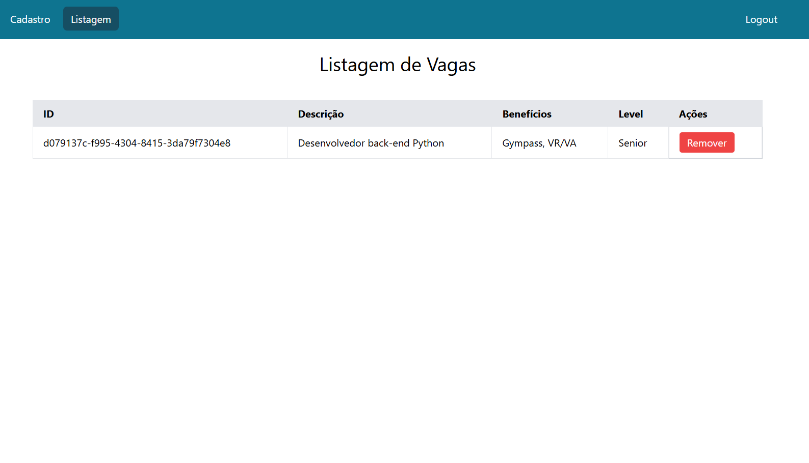

---

# <span style="color:orange;">** Deploy com Render**</span> 
Pra subir essa aplicação, usei o Render (cloud hosting) por ter uma versão grátis pra estudo.

##Como fazer isso?
  - Faça login no Render usando sua conta do GitHub
  - Faça as primeiras configurações simples, como configurar nome, banco de dados...
  - Crie um dockerfile no seu projeto com a configuração do dockerfile config vista mais abaixo.
  - Crie umnovo web service no Render, e faça o deploy com seu último commit no git.


```
# =========================
# Stage 1: Build
# =========================
FROM maven:3.9.3-eclipse-temurin-17 AS build

# Define diretório de trabalho
WORKDIR /app

# Copia apenas o pom.xml para cache do Maven
COPY pom.xml .

# Baixa dependências sem reconstruir código
RUN mvn dependency:go-offline -B

# Copia o código-fonte
COPY src ./src

# Build do projeto, gera o .jar
RUN mvn clean package -DskipTests

# =========================
# Stage 2: Runtime
# =========================
FROM openjdk:17-jdk-slim

# Define diretório de trabalho
WORKDIR /app

# Copia o .jar do stage de build
COPY --from=build /app/target/gestao_vagas-0.0.1-SNAPSHOT.jar app.jar

# Expõe a porta do Spring Boot
EXPOSE 8080

# Comando para rodar a aplicação
ENTRYPOINT ["java", "-jar", "app.jar"]


ENTRYPOINT [ "java", "-jar", "app.jar" ]
```
---

## <span style="color:orange;">** Criando um banco de dados e webserver na AWS com RDS e EC2**</span> 
- Crie uma conta na Amazon AWS 
- Pesquise por RDS e vá em criar banco de dados  
- Escolhaa standard creation > PostgreSQL > Models: Free tier > Create database  
- Pesquise por EC2  
- AMI - Kernel6.1 - free > Instance: t3.MICRO - free  
- Crie um par de chaves: RSA > .pem  
- Execute a instancia e faça a conexão

---

# <span style="color:orange;">** Criando DockerHub**</span> 
- Com o DockerHub, você pode salvar uma imagem pronta pra uso da sua aplicação, da mesma forma que você salva seu código no GitHub.
- Você só precisa de um arquivo .yml na raiz do seu projeto, o meu ficou assim:

```
name: Gestão de Vagas Application
on: 
    push:
        branches: [main]
jobs:
    build:
        runs-on: ubuntu-latest
        steps:
            - name: Checkout code
              uses: actions/checkout@v3
            - name: Set up Java
              uses: actions/setup-java@v3
              with:
                distribution: temurin
                java-version: 17
            - name: Build project
              run: mvn clean install
            - name: login docker
              run: docker login -u ${{secrets.DOCKER_USERNAME}} -p ${{secrets.DOCKER_PASSWORD}}
            - name: Build docker image
              run: docker build -t felipevalboenodocker/gestao_vagas .
            - name: Publish image
              run: docker push felipevalboenodocker/gestao_vagas        
```
---

### OBS: 
- I used Putty to configure the Docker on EC2 AWS.
- I used a Database Client extension to conect a new postgrSQL to EC2 endpoint, and I change the DTABASE_URL on github to this new database that I create.

---

## How to start the application after all this configurations
  1. Open your Putty app
  2. Connect on the saved session 
  3. execute: cd ~/actions-runner
  4. Check on your github if the runner ar online, if not, execute: ./run.sh
  5. execute: docker start gestao-vagas 
  6. execute: docker ps 
  7. execute: docker logs gestao_vagas , check if the application started as well
  8. Open Swagger: http://<public_ec2_ip>:8080/swagger-ui/index.html an do a test.

