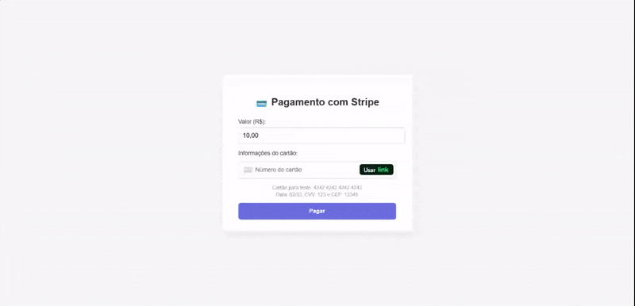

# 💼 **Projeto Java: Pagamento com Stripe**

Este é um simples projeto pra testar a funcionalidade de **tokenização de cartão de crédito**
Com isso, as transações ficam mais seguras, pois os dados do carão são convertidos em um token, pelas API de cartão como Strip ou Mercado Pago.
Ou seja, o Token obtido pelo Strip, representa o cartão com número, CVC e Data. O back-end recebe esse token, e jamais armazena os dados reais do cartão digitado pelo usuário no front-end.

## Demonstração do Projeto

Para executar, basta: 
 - Rodar a aplicação: mvn spring-boot:run
 - Abrir no navegador: http://localhost:8085/

> [Documentação Stripe para testes](https://docs.stripe.com/testing?testing-method=card-numbers#visa)

> Como obter as chaves de API?

1 -  Crie uma conta em https://dashboard.stripe.com/

2 - No canto inferior direito, vá em: Desenvolvedores > Chaves de API

3 - Copie as  Chave publicável e Chave secreta, e substitua respectivamente nas variáveis do properties do projeto.